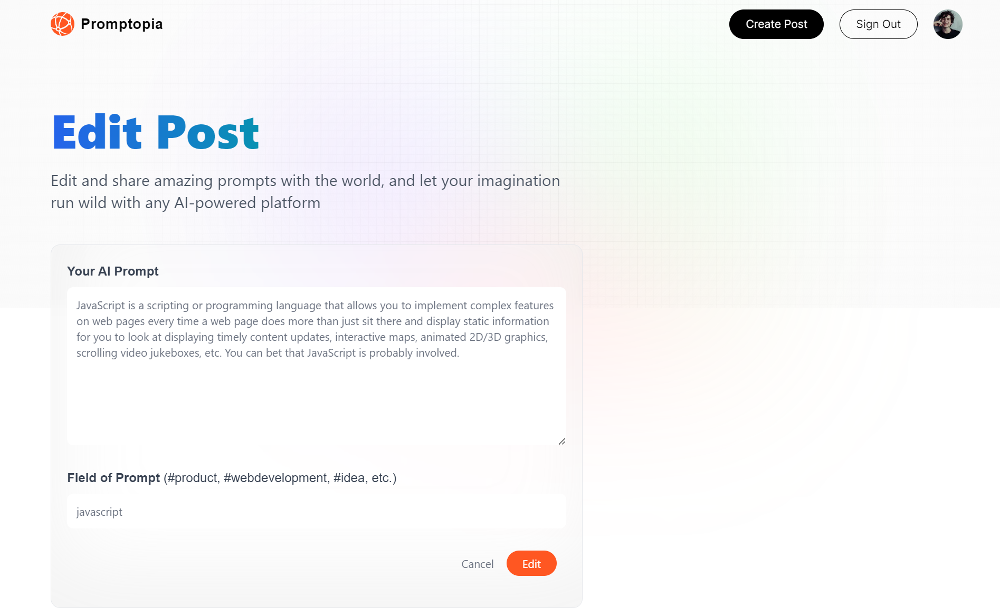

<p align="center" width="40"</p>

# <p align="center" id="top">Promptopia</p>

1. Clone this repo
2. `cd Promptopia`
3. Run `npm install`
4. Run `npm run build`
5. Create `.env` file in server folder
6. Add the env variables 

    ```env
    GOOGLE_ID=""

    GOOGLE_CLIENT_SECRET=""

    MONGODB_URI=""

    NEXTAUTH_URL=http://localhost:3000

    NEXTAUTH_URL_INTERNAL=http://localhost:3000

    NEXTAUTH_SECRET=""
    ```
You can grab the MongoDB url by setting up an [Atlas MongoDB](https://www.mongodb.com/atlas/database) account.

## Preview




Made by Arjunan K

<a href="#top">Back to top</a>
